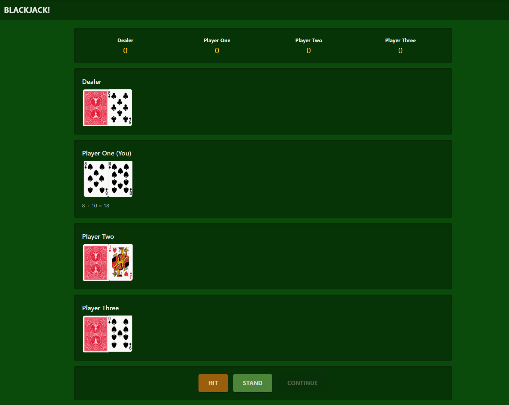
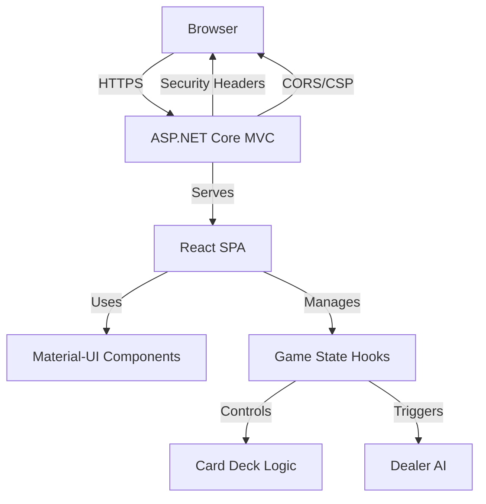
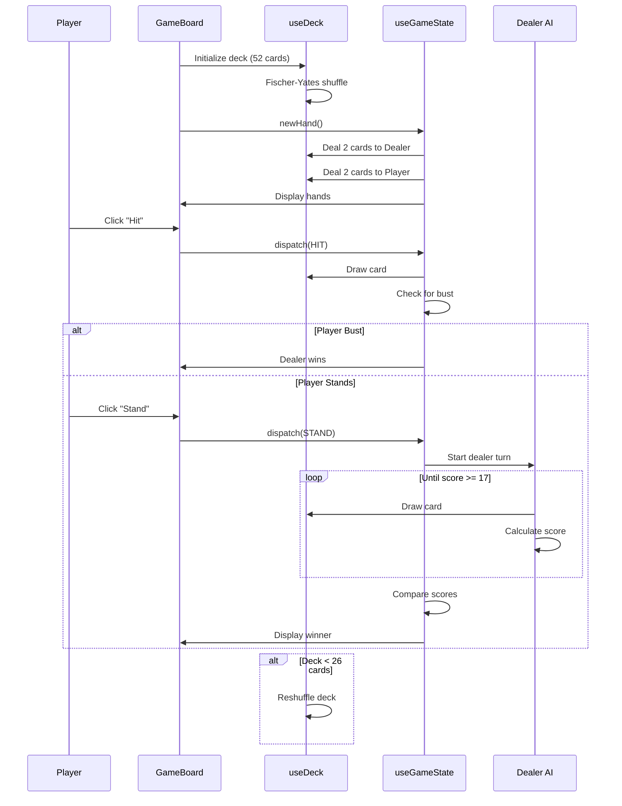

<div align="center">

# Blackjack React

### A modern Blackjack (21) card game built with React 19 + TypeScript and ASP.NET Core (.NET 9)

[](https://dotnet.microsoft.com/download/dotnet/9.0)
[](https://react.dev/)
[](https://www.typescriptlang.org/)
[](https://vitejs.dev/)
[](https://mui.com/)
[](LICENSE)



*Features production-grade security hardening, Material-UI design, and smooth card animations*

[Features](#features) | [Quick Start](#quick-start) | [Architecture](#architecture) | [Security](#security) | [Development](#development)

</div>

---

## Features

<table>
<tr>
<td width="50%">

**Gameplay**
- Full Blackjack rules (hit, stand, bust)
- Ace-aware scoring (1 or 11)
- Dealer AI (draws until ≥ 17)
- Auto deck reshuffle (< 26 cards)

</td>
<td width="50%">

**Frontend**
- React 19 + TypeScript 5.9
- Material-UI v7 dark theme
- 3D card flip animations
- Hooks architecture

</td>
</tr>
<tr>
<td>

**Security**
- Content Security Policy (CSP)
- CORS protection
- Anti-forgery tokens
- HSTS enforcement

</td>
<td>

**Developer Experience**
- Vite 7 HMR
- MSBuild integration
- Vitest + React Testing Library
- SCSS modules

</td>
</tr>
</table>

---

## Quick Start

### Prerequisites

- [.NET 9 SDK](https://dotnet.microsoft.com/download/dotnet/9.0)
- [Node.js 18+](https://nodejs.org/)

### Installation & Run

```bash
# Clone the repository
git clone https://github.com/bwhyte21/Blackjack_x_React_NET.git
cd Blackjack_x_React_NET

# Build and run (automatically builds React app)
dotnet build
dotnet run

# Navigate to https://localhost:5001
```

### Frontend Development (Hot Reload)

```bash
cd ClientApp
npm install
npm run dev
# Vite dev server runs at http://localhost:5173
```

### Production Build

```bash
cd ClientApp
npm run build
cd ..
dotnet publish -c Release -o ./publish
```

---

## Architecture

<details>
<summary><b>System Overview</b></summary>

<br>



</details>

### Backend (.NET 9)

Minimal ASP.NET Core MVC backend serving the React SPA with **enterprise-grade security**:

**Security Features**

| Feature | Implementation |
|---------|----------------|
| **CSP Headers** | Prevents XSS attacks |
| **CORS Policy** | Explicit origin allowlist |
| **Anti-Forgery** | CSRF token configuration |
| **Request Limits** | 10MB max, 100 concurrent connections |
| **Host Filtering** | Prevents Host Header attacks |
| **HSTS** | HTTP Strict Transport Security |
| **Error Handling** | No information leakage in production |

**Key Files**

- `Program.cs` - Security middleware, static files, SPA fallback routing
- `Controllers/HomeController.cs` - Serves the SPA container
- `Controllers/ErrorController.cs` - Handles production errors securely
- `Views/Home/Index.cshtml` - Minimal HTML loading React bundle

### Frontend (React 19 + TypeScript + Vite)

Client-side game logic built with **modern React patterns**:

**Tech Stack**

| Technology | Version | Purpose |
|------------|---------|---------|
| **React** | 19.2 | UI framework |
| **TypeScript** | 5.9 | Type safety |
| **Vite** | 7.3 | Build tool + HMR |
| **Material-UI** | 7.3 | Component library |
| **SCSS** | - | Styling |
| **Vitest** | - | Unit testing |
| **React Testing Library** | - | Component testing |

<details>
<summary><b>Core Components</b></summary>

<br>

- **`GameBoard`** - Main orchestrator with MUI layout, Snackbar notifications
- **`Card`** - Sprite-based card rendering with 3D flip animations
- **`CardHand`** - Displays player/dealer hands with face-down logic
- **`GameControls`** - Hit/Stand buttons with game state awareness
- **`Scoreboard`** - Tracks rounds won per player

</details>

<details>
<summary><b>Custom Hooks</b></summary>

<br>

- **`useDeck`** - Fischer-Yates shuffle, card drawing, Ace-aware scoring (1 or 11)
- **`useGameState`** - `useReducer`-based game state, dealer AI, win/loss detection

</details>

<details>
<summary><b>Styling System</b></summary>

<br>

- Card sprites from `full_deck.png` (93px x 115px per card)
- 3D rotation animations (`rotateInCard`, `flipCard`)
- MUI dark theme with custom palette:
  - **Table**: `#0d5d0d` (green)
  - **Accents**: `#ffd700` (gold)

</details>

---

## Project Structure

```
Blackjack_x_React_NET/
├── ClientApp/                      # React + TypeScript frontend
│   ├── src/
│   │   ├── components/            # React components
│   │   │   ├── GameBoard/
│   │   │   ├── Card/
│   │   │   ├── CardHand/
│   │   │   ├── GameControls/
│   │   │   └── Scoreboard/
│   │   ├── hooks/                 # Custom React hooks
│   │   │   ├── useDeck.ts
│   │   │   └── useGameState.ts
│   │   ├── types/                 # TypeScript definitions
│   │   │   └── game.types.ts
│   │   ├── styles/                # SCSS modules
│   │   │   ├── cards.scss        # Card sprite positioning
│   │   │   ├── animations.scss   # 3D card animations
│   │   │   └── global.scss
│   │   ├── test/                  # Test utilities
│   │   ├── theme.ts               # MUI theme configuration
│   │   ├── App.tsx
│   │   └── main.tsx
│   ├── public/images/             # Card sprites (dev)
│   ├── package.json
│   ├── vite.config.ts
│   └── tsconfig.json
├── Controllers/
│   ├── HomeController.cs          # SPA entry point
│   └── ErrorController.cs         # Error handling
├── Views/Home/
│   └── Index.cshtml               # SPA container
├── wwwroot/
│   ├── dist/                      # Vite build output
│   └── images/                    # Card sprites (production)
├── Program.cs                     # ASP.NET startup + security
├── appsettings.json
├── appsettings.Production.json
├── BlackjackReact.csproj          # MSBuild React integration
└── SECURITY_PLAN.md               # Comprehensive security guide
```

---

## Game Flow



### Step-by-Step

1. **New Hand**: Dealer gets 2 cards (one face-down), Player One gets 2 cards
2. **Player Turn**: Click **Hit** (draw card) or **Stand** (end turn)
3. **Bust Detection**: If player exceeds 21, dealer wins automatically
4. **Dealer AI**: Dealer reveals hole card, draws until score ≥ 17
5. **Scoring**: Highest score ≤ 21 wins; Aces count as 1 or 11
6. **Auto Reshuffle**: Deck reshuffles when < 26 cards remain

---

## Security

The application implements **production-grade security measures**:

| Security Feature | Status | Description |
|------------------|--------|-------------|
| **Content Security Policy** | ✅ | Prevents XSS attacks |
| **CORS Protection** | ✅ | Explicit origin allowlist |
| **Host Header Filtering** | ✅ | Prevents injection attacks |
| **Request Size Limits** | ✅ | DoS mitigation (10MB max) |
| **HSTS** | ✅ | HTTP Strict Transport Security |
| **Anti-Forgery Tokens** | ✅ | CSRF protection configured |
| **Secure Error Handling** | ✅ | No information leakage |

> **See [SECURITY_PLAN.md](./SECURITY_PLAN.md)** for the complete security architecture and implementation roadmap.

---

## Development

### Build Commands

```bash
# Full build (backend + frontend)
dotnet build

# Frontend only
cd ClientApp && npm run build

# Production build
dotnet publish -c Release

# Run tests
cd ClientApp && npm test

# Run tests in watch mode
cd ClientApp && npm run test:watch

# Generate coverage report
cd ClientApp && npm run test:coverage
```

### Development Workflow

```bash
# Terminal 1: React dev server (HMR)
cd ClientApp
npm run dev

# Terminal 2: .NET backend
dotnet run
```

**Access Points:**
- Vite HMR: `http://localhost:5173`
- Full integrated app: `https://localhost:5001`

### Configuration

<details>
<summary><b>Production Configuration</b></summary>

<br>

**CORS Origins** (update for production):

```csharp
// Program.cs
policy.WithOrigins("https://yourdomain.com")
```

**Allowed Hosts** (update for production):

```json
// appsettings.Production.json
"AllowedHosts": "yourdomain.com;www.yourdomain.com"
```

</details>

---

## Dependencies

<table>
<tr>
<td width="50%">

### Backend
-  .NET 9.0
- ASP.NET Core MVC

</td>
<td width="50%">

### Frontend
-  React 19.2
-  TypeScript 5.9
-  Material-UI 7
-  Vite 7
- SCSS
- Vitest
- React Testing Library

</td>
</tr>
</table>

---

## Future Enhancements

- [ ] Player Two & Three AI logic
- [ ] Betting system with chips
- [ ] Split hands on pairs
- [ ] Double down option
- [ ] Persistent game statistics (database)
- [ ] User authentication
- [ ] Multiplayer via SignalR
- [ ] Mobile responsive layout

---

## License

This project is open source and available under the [MIT License](LICENSE).

---

## Contributing

Contributions are welcome! Please feel free to submit a Pull Request.

1. Fork the repository
2. Create your feature branch (`git checkout -b feature/AmazingFeature`)
3. Commit your changes (`git commit -m 'Add some AmazingFeature'`)
4. Push to the branch (`git push origin feature/AmazingFeature`)
5. Open a Pull Request

---

<div align="center">

**Built with <3 using React 19, TypeScript, and .NET 9**

[](https://github.com/bwhyte21/Blackjack_x_React_NET/stargazers)
[](https://github.com/bwhyte21/Blackjack_x_React_NET/network/members)

</div>
